## Introduction
In today’s digital world, security is a big-data problem. A malware infiltration can be disastrous - consequences include data theft, extortion or the crippling of network systems.

According to StatCounter, Microsoft Windows OS rules the market with a 76.26% share of the desktop OS market share in January 2021. With this comes the biggest challenge for Microsoft - to provide antivirus softwares or other security products which keep the Windows machine from being infected with malware and to keep the user data secure from these attacks. It would be beneficial to understand the threat level associated with the different hardware/software features.

## Problem definition
Microsoft proposed a data-based challenge to develop machine learning solutions that can predict whether a machine is susceptible to malware. We will use a subset of this dataset to answer the following questions:
- How likely is a machine to be infected by malware soon in the future, given its properties and telemetry data?
- Which factors are most and least effective in increasing or decreasing susceptibility to malware?
- Which custom features can be derived to improve predictive performance?
- Which learning techniques perform are best able to uncover these insights?

The dataset [1] contains information of over 8M Windows machines annotated with whether or not they were infected by malware and 82 columns describing each machine's telemetry data and product information.

## Data Collection and Cleaning
A few years ago, Microsoft, in collaboration with Northeastern University and Georgia Tech, organized a contest to predict if a system is going to be affected with Malware or not depending upon the system configuration. The same database is available in Kaggle [here](https://www.kaggle.com/c/microsoft-malware-prediction/data). We used this dataset for our project purposes.
 
The original training data had over 8 million datapoints and each datapoint had 82 features and the classification label. The features were both numerical and categorical in nature. For the purposes of the project, we selected 30000 datapoints based on a random sampling approach. We divided the 30000 samples into 2 sets: training set with 24000 samples and testing set with 6000 samples.  

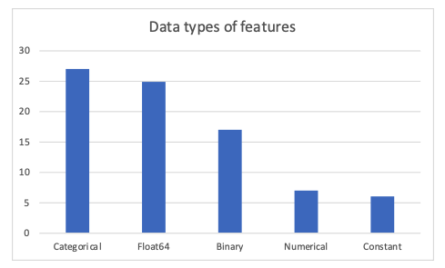  

Out of the 82 features, some of the features were missing for most of the data points. We have eliminated features which had missing values for more than 20000 samples. There were 5 such features. Many of the features had missing values for some of the samples. For numerical value based features, we replaced the missing values with median because most of our features were in the form of binary values or integers. Taking a mean would have given a decimal value and that would not have made much sense. For string value based features, we replaced the missing values with “UNKNOWN”. If possible, we plan to spend more time on cleaning string based values for the final phase.  

Once we filtered the null value features, we have to encode the categorical data so that it can be used by various ML algorithms. We used the “LabelEncoder” provided by sklearn library to perform the encoding. After encoding, we normalized the data. The normalization we used is Min-Max normalization. While performing normalization, certain features were giving errors because the min and max value were the same for these features. We eliminated these 5 features as they aren’t providing much useful information. 

### Removing features based on correlation
Through the process of correlation we wanted to understand the relationship between multiple features/columns in the dataset. The heat map below shows the correlation values. We can see that the dark red boxes show a correlation value greater than 0.99

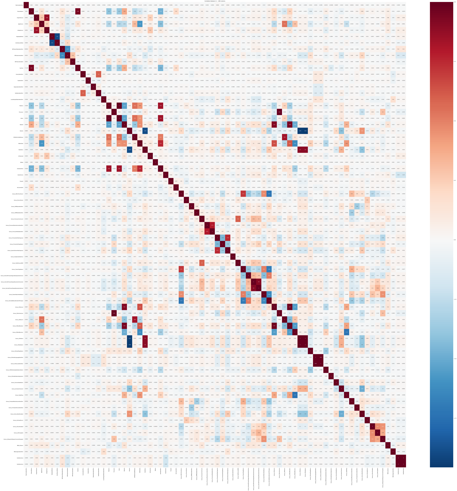  

We found that there were 4 sets of highly correlated features. For example the columns ‘Platform’ and ‘osversion’ have a correlation value of 1. So we can eliminate any one of them. Since the column ‘Platform’ has lesser unique values we decided to remove the column ‘Platform’. 
After doing a similar process for the other features , our resulting data set now 68 columns.
|                 | Original Dataset |Our Dataset|
| --------------- | ---------------- |-----------|
| No of datapoints| 8M+              |30000      |
| Features        | 82               |68         |
 

### Data Label Distribution
Inspecting the data we see that the distribution is almost equal for the HasDetections field which is our label. 

 

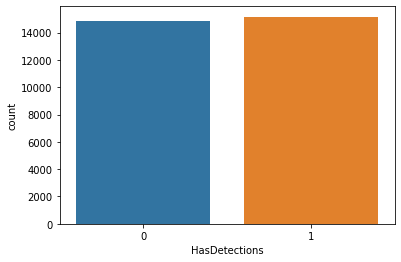  
## Methods

### Supervised
We have used the following models for our supervised learning approach to classify whether a given combination of features will have malware or not.
1. XGBoost
2. Random Forest
3. Decision Tree
4. Logisitic Regression
5. SVM
6. Gradient Boosting
7. Neural Network

We used Keras to implement the neural network, and Scikit-Learn for all other models. We also performed hyperparameter tuning for the following models:
1. XGBoost
2. Random Forest
3. SVM
4. Neural Network

We chose these models for hyperparameter tuning because they showcase diverse methods for classification. Random Forests and XGBoost provide two tree based approaches to classification while SVM provides linear and non-linear classificaitions. Additionally, these models provided the best performance during our explaratory analysis. 

### Unsupervised

One of our first objectives was to be able to visualize our dataset in a more meaningful way to uncover insights for further experiments and reduce dimensionality. Thus, we start with dimensionality reduction using PCA. Knowing that PCA can only capture linear relations between dimensions, we further tried visualization using t-SNE -- as it is usually a favored choice for dimensionality reduction specifically for visualization purposes. Then, we also applied the reduced dimensionality from PCA to supplement one of our previously tried supervised approaches to see if it improves the performance.

## Results

### Supervised
We use the metrics - accuracy, f1-score, precision and log-loss to measure the performance of each of our models. The results for the experiments are given below: 
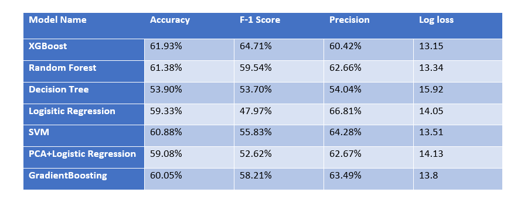
 

We also plotted the confusion matrix for each of the models:

 

 

 
 

### Feature Importance and Feature Selection
We also looked at the feature importance that each model gave to the various features. We picked the top 15 features with highest feature importance values for each model and plotted them on a bar graph. These are provided below:

 
 

 
** Table: Comparison of commonly recurring features in various models

|                                                   | XGBoost | Random Forest | Decision Tree | Logistic Regression | SVM |
|---------------------------------------------------|---------|---------------|---------------|---------------------|-----|
| SmartScreen                                       | X       | X             | X             |                     |     |
| AVProductsInstalled                               | X       |               |               |                     |     |
| EngineVersion                                     | X       |               |               |                     |     |
| Census_TotalPhysicalRAM                           | X       |               |               |                     | X   |
| Census_PrimaryDiskTotalCapacity                   | X       |               |               |                     | X   |
| IsProtected                                       | X       |               |               |                     | X   |
| AVProductStateIdentifier                          | X       | X             |               | X                   | X   |
| AvSigVersion                                      | X       | X             | X             | X                   | X   |
| Census_InternalPrimaryDiagonalDisplaySizeInInches | X       | X             | X             |                     |     |
| Census_InternalPrimaryDisplayResolutionHorizontal |         |               |               | X                   | X   |
| Census_OSBuildRevision                            | X       | X             | X             |                     |     |
| Census_OSBuildNumber                              |         |               |               | X                   | X   |

As can be seen from these graphs and the table above, the features - AvSigVersion, AVProductStateIdentifier, SmartScreen, Census_InternalPrimaryDiagonalDisplaySizeInInches and Census_OSBuildRevision - are given high importance in multiple models.

We also picked the bottom 15 features with the lowest feature importance values for each model and plotted them on a bar graph. These are provided below:

 
 

 

As we can see from the bar graphs, there are common features which have been given the least importance by majority or all of these models. We have provided such features in the table below:

|                                  | XGB | SVM | RF | LR | DT |
|----------------------------------|-----|-----|----|----|----|
| Census_IsPortableOperatingSystem | X   |     | X  |    | X  |
| IsSxsPassiveMode                 | X   |     | X  |    | X  |
| SMode                            | X   | X   | X  | X  | X  |
| Census_DeviceFamily              | X   | X   | X  | X  | X  |
| ProductName                      | X   | X   | X  | X  | X  |
| HasTpm                           | X   |     | X  |    | X  |
| OsVer                            | X   | X   | X  | X  | X  |
| UacLuaenable                     |     | X   | X  | X  | X  |
| Census_IsVirtualDevice           |     | X   | X  | X  | X  |

We performed feature selection experiments with the following results:
1. Remove all 9 features that have been marked as low importance by majority of the models (shown in the table above). The results for the models are given below:

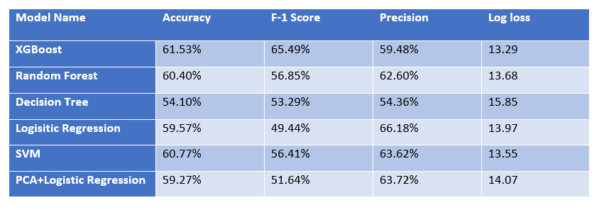

2. Remove the 4 features: 'SMode', 'Census_DeviceFamily', 'ProductName' and 'OsVer' that are marked as low importance in all the models. The results for the models are given below:

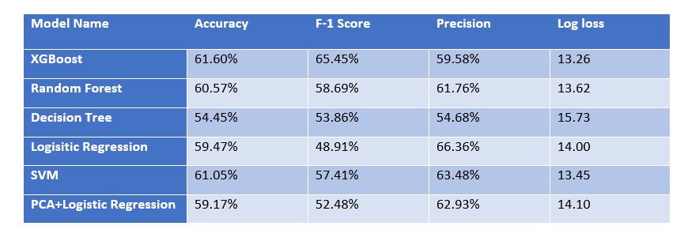

### ROC Curve
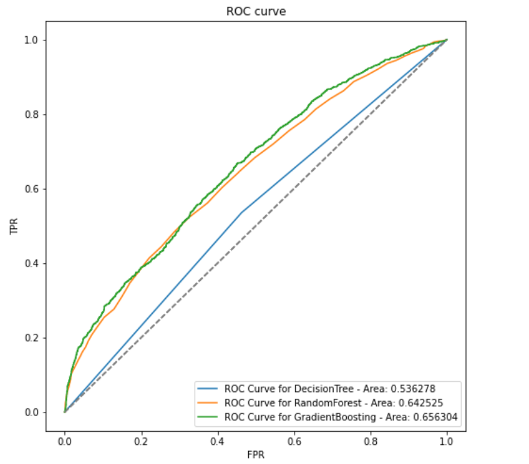
 

The roc curve is generally used to show the performance of the classifier.  Here we can clearly see that the gradient boosting algorithm covers the maximum area under the classifier followed by random forest and decision tree.

### Neural Network

We used Keras to train a 3-layer percepteron to perform binary classification, with a LeakyReLU activation on the hidden layers. Initially, we saw that our network could achieve accuracies higher than 77%, but was heavily overfit, as shown below on the left.

 

We attributed this to overparametrization of the network given the relatively small dataset size and no regularization. However, with regularization (L2 and Dropout), the network struggled to achieving a good accuracy without overfitting. Since NNs are able to scale well with more data, we switched to the larger dataset of 80k samples. We further tuned the hyperparams by decreasing the batch size, adding a learning rate schedule, and opting for a deeper instead of wider network. With this, we were able to achieve an accuracy of 62-63% on both training and validation sets, as shown on the right above.

### Unsupervised

The below plots show 2D-projections of our 69-dimensional data using PCA and t-SNE.

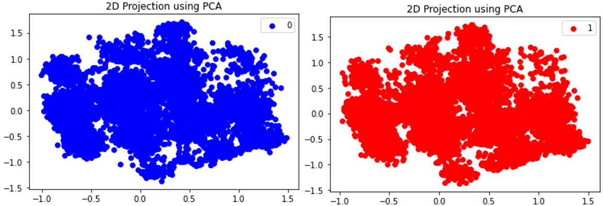

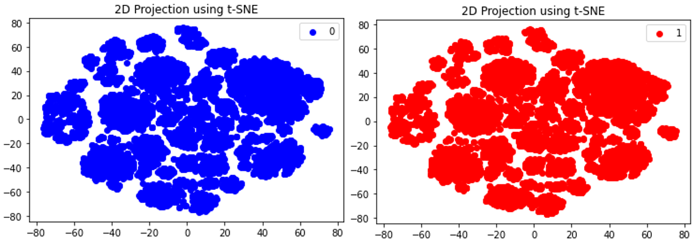

Note how both PCA & t-SNE uncover projections that are not discriminative on the class labels. Since both methods are label-agnostic, this is possible, and we posit that this might mean the direction of maximum variance (in case of PCA) are useful to reconstruct the data but not necessarily to discriminate between the classes. For this reason, we refrain from using PCA for feature selection.

Shown below are the cumulative variances explained by each principal component in PCA.

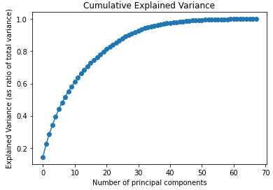

We can see above that about 40 components account for over 98% of the total variance. Finally, we build a Logistic Regression classifier using just these 40 components and see that we can achieve similar accuracy with this reduced data, as shown in the model comparison [table](#Supervised-1).

### Hyperparameter Tuning

We used GridSearchCV (from scikit learn) to fit models under different hyperparameters while also scoring them. To compare different models using these hyperparameters, we used the Mean test score as a metric. The models used for hyperparameter training were XGBoost, Random Forest and SVM.

#### XGBoost

We focused on the following hyperparameters to improve the performance of the XGBoost model:

1. Number of Estimators
2. Max Depth
3. Min Child Weight
4. Learning Rate

To compare performance with respect to different values of these hyperparameters, we considered each hyperparameter individually. The following graphs show mean test scores for each hyperparameter varied across a set of values:

 

The only significant variation is seen in the learning rate while the mean test score varies moderately while changing the number of estimators and max depth. The best parameters came out to be Number of Estimators = 50, Max Depth = 6, Min Child Weight = 20 and Learning Rate = 0.1.

#### Random Forest

To improve the performance of the Random Forest classifier, the following hyperparameters were considered:

1. Number of Estimators
2. Maximum Depth
3. Bootstrap (True/False)
4. Minimum Samples Leaf
5. Minimum Samples Split

For our first experiment, we only considered the Bootstrap, Minimum Samples Leaf and Minimum Samples Split parameters while using default values for Number of Estimators and Maximum Depth (100 and None). The following graph showcases the results from this experiment.

 

It can be seen that the mean test score is drastically affected by our choice of Bootstrap, Minimum Samples Leaf and Minimum Samples. We can see that the best results are obtained when Minimum Samples Leaf = 10, Minimum Samples Split = 4 and Bootstrap = True.

For our next experiment, we have kept Minimum Samples Leaf = 10, Minimum Samples Split = 4 and Bootstrap = True while testing for different values of Max Depth and Number of Estimators.

 

It is evident that neither of these parameters have a significant impact on the overall test score. Nevertheless, the best performance is observed when max_depth = 30 and Number of estimators = 800.

#### SVM

To optimize the Support Vector Machine classifier, the following parameters were considered:

1. Kernel (linear/rbf)
2. Regularization parameter, C
3. Gamma (Kernel coefficient for rbf)

For the first experiment, using the linear SVM Kernel, we compared the mean test scores for different values of C.

 

It can be seen that the mean test score improves as the value of C increases. The best mean test error is achieved when C = 100.

In the second experiment, we use the radial basis function kernel (rbf) and compare the mean test score against different values of C and gamma.

 

We can see that the mean test score is affected moderately as C and Gamma are varied. The best performance is observed for C = 10, Gamma = 0.01 and kernel = rbf.

In the third experiment, we use the sigmoid kernel and compare the mean test score against different values of C and gamma.

 

Similar to the rbf kernel, the mean test score is changes moderately as C and Gamma are varied. The best performance is again observed for C = 10, Gamma = 0.01 and kernel = rbf.

The following results compare accuracy before and after hyperparameter tuning:

|               | Before |After  |Chosen Parameters                                                                        |
| --------------| ------ |-------|-----------------------------------------------------------------------------------------|
| XGBoost       | 61.93% |62.72% | n_estimators=50, max_depth=6, min_child_weight=20, learning_rate=0.1                    |
| Random Forest | 61.38% |62.7%  | n_estimators=800, max_depth=30, min_samples_split=4,min_samples_leaf=10,bootstrap=True  |
| SVM           | 60.88% |61.07% | C = 100, kernel = linear                                                                |
 

### Comparison of supervised learning algorithms for different dataset sizes

We tried to run the different supervised learning algorithms on datasets of different sizes and see how well the evaluation metrics like accuracy and precision vary for different dataset sizes. For our experiment, we have chosen 3 datasets with sizes 20k, 50k and 80k, respectively. The data points were chosen randomly. As before, 80% of the dataset was reserved for training and 20% for testing purposes.  

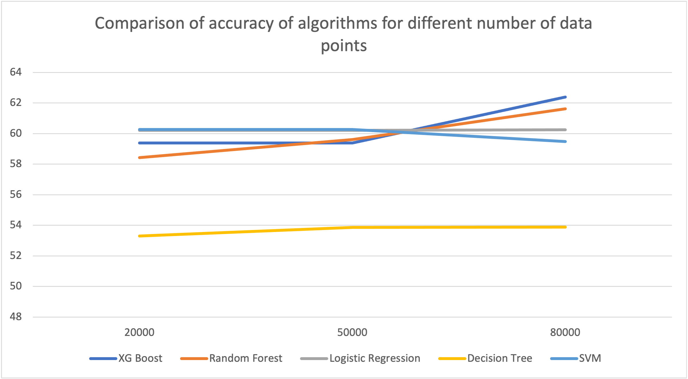  

The above graph shows the variation of accuracy for different supervised learning techniques. Random Forest, Decision Tree and XG Boost perform well as the size of the dataset increases. In general, we can say tree based algorithms perform well as the dataset size increases. Logistic Regression improves only marginally. SVM seems to degrade in accuracy.  

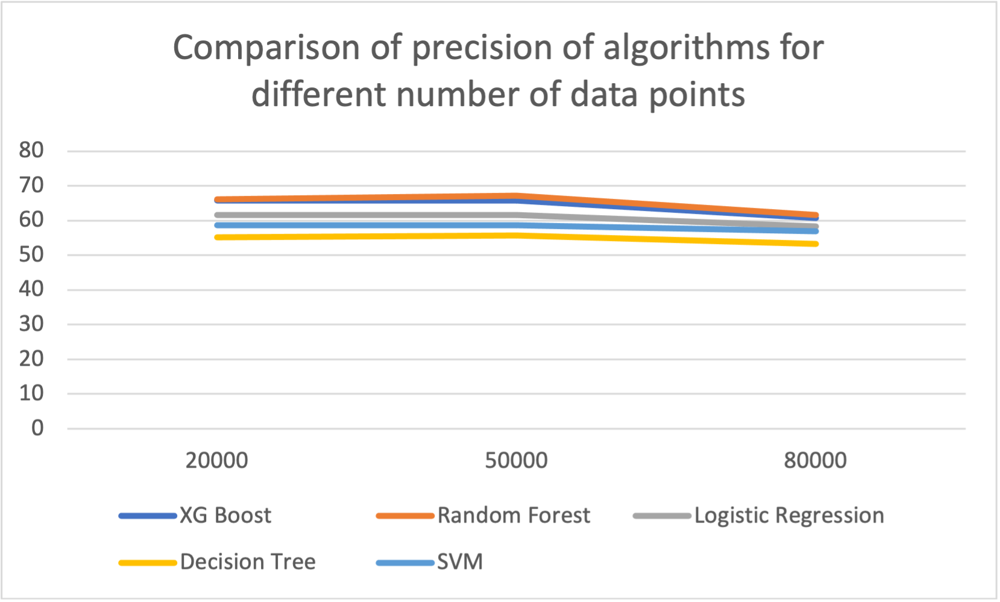  

The above graph shows the variation of precision for different algorithms for different dataset sizes. It looks like the precision is dropping for all the algorithms when the dataset size increases. Although we have seen accuracy increase for some of the algorithms, the precision seems to have reduced for those as well. The reason for this could be that the number of false positives are higher with higher dataset sizes. This theory can be confirmed using the confusion matrices. In the below confusion matrices, you can see that as the number of data points increase, both true positives and false positives increase, and as a result the precision decreases. 

  

  

  

## Discussion
As apart of this project, we cleaned the dataset by subsampling rows for a more manageable size, removed features with high correlation, and high ratio of NaN values before modeling the data. We performed hyperparameter tuning on three classifiers - XGBoost, Random Forest and SVM. Hyperparameter tuning led to a slight performance increase for XGBoost and Random Forest classifiers while only a negligible increase was observed for SVM. We trained multi-layer perceptron in Keras and experimented with hyperparameters related to optimization, model architecture, and dataset size.

We plotted the highest and the lowest feature importance for each model and checked the effect of removing the least important features on the accuracies. We observed small increases in accuracy for a few models but not for all. The feature ‘OSVer’ was given low importance by all models which was surprising. For the features with the highest importance for all models, there were some interesting observations. As can be seen from the results, the following features are of high importance as shown by multiple models: AvSigVersion, AVProductStateIdentifier, SmartScreen, Census_InternalPrimaryDiagonalDisplaySizeInInches and Census_OSBuildRevision. Some of these features such as SmartScreen are directly meant to enhance Windows security. However, it's interesting to see factors like display size also featuring in this list, and can be studied further.

We also saw that the neural networks can be overparametrized & easily overfit with the current dataset with 30k records. We observed that increasing the dataset size helped. We believe that further improvement is possible with one-hot encoding and embedding for the discrete-valued features.

We saw that techniques like PCA are useful for data reconstruction but not feature selection, as they combine multiple features and are label-agnostic.

We observed that the accuracy went up for Random Forest, Decision Tree, XGBoost with increase in the dataset size. So we can see that the tree based classifiers performed better than the other classifiers. Furthermore, the precision went down for all the models with increase in dataset size. This can be attributed to the increase in both the true positives and false positives with the dataset size increase.

## Conclusion
Based on the accuracy we can see that the XGBoost model outperforms the other models to classify whether a computer with a given set of features has malware or not. Our best classifiers got ROC-AUC scores of ~0.64, nearing the classification performance of the top submissions on Kaggle for this dataset at 0.67 AUC.

As next steps, we could drill deeper into data cleaning and see how the results change accordingly. If the labelled data was not distributed evenly, we would have to consider taking a subset of balanced data.
Future work would also include tuning hyperparameters for other classifiers such as Gradient Boosting and Logistic Regression. Also, hyperparameter tuning can be explored for all classifiers while varying dataset sizes. We also need to look more into the feature importance insights to conclude more details on necessary or unecessary features for our task.

## Team Contribution
 
**1. Ginni:** Worked on the models - XGBoost and Random Forest,  plotting the confusion matrix and metrics for all models. Worked on finding features with the highest and the least importance according to the models and using removing least important features to see changes in the model results.

**2. Manas:** Unsupervised Learning, Visualization using PCA and t-SNE, Dimensionality Reduction with Logistic Regression, Neural network training and tuning

**3. Raveena:** Worked on Feature selection-Correlation Map,visualization of label distribution,implemented model (Gradient Boosting), Implementing roc curve for random forest, decision tree and gradient boost

**4. Santhosh:** Created the training dataset from the original 8 million records file, encoded the categorical data, filtered out features which have high number of missing values, compared the different supervised learning algorithms for different data set sizes

**5. Suhaib:** Encoded categorical data and performed feature pruning. Worked on the SVM and Logistic Regression classifiers. Performed hyperparameter tuning for XGBoost, Random Forest and SVM.

## References
1. “Microsoft Malware Prediction Dataset,” Kaggle. Available at https://www.kaggle.com/c/microsoft-malware-prediction/data.

